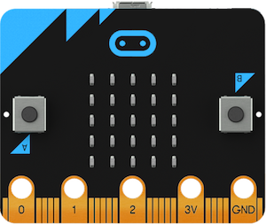
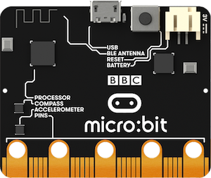
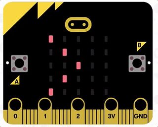
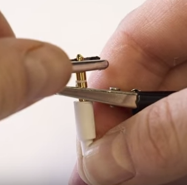

<div style="position: fixed;top: 1em;right: 1em">
  <a href="" style="text-decoration:none"><b>^^^</b></a>
</div>

<h1>Creatief programmeren met Python & micro:bit</h1>

(27/03/'17) - Tim Molderez en Mathijs Saey

<h2>Inhoudstafel</h2>

[TOC]

## 1. Micro:bit introductie

De [micro:bit](http://microbit.org/nl) is een *embedded systeem*, een (kleine) computer die bedoeld is om allerlei apparatuur/elektronica aan te sturen met behulp van software: knoppen, lampen, sensors, motors, machines, enz. Embedded systemen vind je zowat overal terug: auto's, printers, telefoons, fototoestellen, wasmachines, microgolf ovens, ... Des te "slimmer" apparaten zijn, des te groter de kans dat je er een embedded systeem in zal terugvinden.



Om even een korte rondleiding te geven van de micro:bit zelf; op de voorkant vind je het volgende terug:
- 5 x 5 LED lampjes
- 2 knoppen (gelabeld A en B)
- Onderaan: aansluitingen voor extra elektronica (sensors, luidsprekers, motors, ..)



Op de achterkant van de micro:bit vind je het volgende:

- Micro USB aansluiting om je micro:bit op een desktop/laptop aan te sluiten
- Reset knop: hiermee kan je je programma herstarten
- Batterij: door de batterij aan te sluiten kan het programma op je micro:bit nog altijd gestart worden, ook al is deze niet meer op de PC aangesloten.
- Processor: deze zal de instructies van je programma effectief uitvoeren en hierbij de andere onderdelen van de micro:bit aanspreken. (Als je programma bv. een instructie bevat om een lamp aan te zetten, dan is het de processor die uiteindelijk de stroom van de lamp aanzet.)
- Kompas: om de oriëntatie van de micro:bit te meten
- Accelerometer: om te meten aan welke versnelling de micro:bit beweegt/draait. (Een smartphone gebruikt bv. een accelerometer om te bepalen in welke richting je hem vasthoudt.)
- Bluetooth antenne: om draadloos informatie te verzenden/ontvangen

## 2. Python introductie

De micro:bit op zichzelf zal niets doen als er geen programma op staat. Om de micro:bit tot leven te brengen gaan we leren om er programma's voor te schrijven.

Een programma is op zich niets meer dan een lijst van instructies die je aan een computer geeft om uit te voeren. Als je mensen kan rond bevelen kan je dus ook programmeren :) Net zoals bij mensen, kan je best duidelijke instructies geven in een taal die de computer begrijpt. De programmeertaal die we voor de micro:bit gaan gebruiken noemt [Python](https://www.python.org).


De Python taal is niet zomaar een "speelgoed" programmeertaal die enkel bedoeld is voor de micro:bit. Het is een volwaardige programmeertaal waarmee je o.a. ook programma's kan maken voor je eigen computer. Ze wordt dagdagelijks gebruikt door bedrijven zoals Google, Disney of zelfs door Nasa om bv. de Mars Curiosity rover te testen.

### 2.1. Mijn eerste programma

Om kennis te maken met Python zullen we beginnen met het volgende kleine programma:

```python
from microbit import *
display.scroll("Hello!")
```

Het bestaat uit twee instructies. Het eerste, ```from microbit import *```, duidt aan welke "woordenschat" nodig is in ons programma. In bijna alle programma's die we gaan schrijven zal deze instructie sowieso bovenaan staan. De tweede instructie, ```display.scroll("Hello!")```, zal de tekst ```Hello!``` op het micro:bit scherm tonen.

Om dit programma nu op de micro:bit te zetten, doe je het volgende:
1. Sluit de micro:bit aan op de computer met de USB-kabel.
1. Open de ["Mu" programmeeromgeving](https://codewith.mu), waarmee je Python programma's kan schrijven en deze naar de micro:bit sturen.
1. Geef de twee instructies van het programma in. (zoals aangegeven in de afbeelding hieronder)
1. Klik nu op de "Flash" knop. Deze knop zal je programma naar de micro:bit sturen. (Je zal het oranje lampje op de achterkant van de micro:bit nu zien blinken. Dit kan enkele seconden duren.)
1. Zodra het programma verstuurd is zal het automatisch starten.


Als alles goed is gelukt zal je nu het volgende zien:


**Let op!** Een computer is een pietje-precies! Je moet de instructies **exact** overtypen. Zo wordt een onderscheid gemaakt tussen hoofdletters en kleine letters. ```Display``` betekent bv. niet hetzelfde als ```display```. Mocht er een fout in je programma zitten, dan zal een (obscure) foutboodschap getoond worden op je micro:bit scherm. In zo'n geval corrigeer je de fout in het programma en druk je gewoon opnieuw op "Flash".

**Tip!** Tijdens het overtypen van de instructies zal je merken dat de Mu programmeeromgeving je op sommige plaatsen automatisch probeert aan te vullen. Dit kan heel handig zijn om sneller te typen, en ook om typfouten te voorkomen.

**Tip!** Je zal ook merken dat de Mu programmeeromgeving sommige woorden in je instructies een specifieke kleur geeft, bijvoorbeeld de tekst ```"Hello!"```. Dit is zo gedaan opdat je je programma gemakkelijker kan lezen, wat duidelijk zal worden naarmate onze programma's iets langer en complexer zullen worden.

*Extra info over de* ```from microbit import *``` *instructie: Deze instructie duidt aan welk stuk "woordenschat" we nodig hebben in ons programma. Dit is net zoals je de woordenschat van bv. het Nederlands kan opdelen in stukken: basiswoorden, woorden over sport, woorden over wetenschap, enz.
Sommige woorden kunnen echter in meerdere stukken voorkomen; "golf" heeft bv. meerdere betekenissen: een natuurverschijnsel, een sport, radiogolven, een baai, ... Opdat programma's duidelijk en ondubbelzinnig zijn, moeten we dus eerst expliciet aangeven welke woordenschat nodig is. In dit geval, de "microbit" basiswoordenschat. Hiernaast is er ook bv. woordenschat om muziek te spelen op de microbit, draadloos te communiceren, ...*

### 2.2. Meerdere instructies

Ons eerste programma deed eigenlijk maar één ding; ```Hello!``` tonen. In dit voorbeeld gaan we wat meer instructies meegeven:

```python
from microbit import *
display.scroll("Hello!")
sleep(3000)
display.scroll("Bye :)")
```

[Bekijk de uitvoering van dit programma](ani/hello-bye.gif)

De instructies van een programma worden in volgorde uitgevoerd: eerst de woordenschat aangeven, dan ```Hello!``` tonen, dan de ```sleep(3000)``` instructie (waarmee je de micro:bit 3000 milliseconden laat wachten), en tenslotte ```Bye!``` tonen.


### 2.3. Waardes onthouden

Een belangrijk onderdeel van programma's schrijven is dat, tijdens de uitvoering van je programma, je allerlei informatie wil onthouden zodat je ze later in je programma kan gebruiken. Om een eenvoudig voorbeeld te geven:

```python
from microbit import *
firstname = "Joske"
display.scroll("Hello, ")
display.scroll(firstname)
sleep(1000)
display.scroll("Bye, ")
display.scroll(firstname)
```

[Bekijk de uitvoering van dit programma](ani/vars.gif)

Een nieuwe instructie die je hier ziet staan is ```firstname="Joske"```.

Dit kan je lezen als "Vanaf nu moet je de tekst ```Joske``` onthouden onder de naam ```firstname```." Of, om het preciezer te zeggen: "Vanaf nu is de *variabele* ```firstname``` gelijk aan de tekst ```Joske```."

Als je die variabele ```firstname``` dan later in je programma vernoemd, dan zal dit tijdens de uitvoering vervangen worden door ```Joske```. In dit programma wordt de variabele bv. gebruikt in de instructie ```display.scroll(firstname)```.

**Belangrijk!** Voor alle talen, inclusief programmeertalen als Python, zijn er grammatica regels. Het wijzigen van een variabele, dus de ```firstname="Joske"``` instructie, heeft in het algemeen de volgende vorm:

```python
variabele=waarde
```

Een "waarde" kan allerlei dingen zijn: een stuk tekst, een geheel getal, een reëel getal, of meer complexe vormen van informatie (waar we nu niet op in gaan). Hieronder nog enkele concrete voorbeelden waarin variabelen gewijzigd worden:

```python
street="Trammezandlei"
housenr=122
pi=3.14159
``` 
Iets wat uiteindelijk een waarde zal worden mag ook, bijvoorbeeld een berekening:

```python
fahrenheit= 20 * 9/5 + 32
```

### 2.4. Tekeningen maken

Tijd om onze kennis in iets leuks om te zetten! Onderstaand programma zal een kleine tekening maken op het micro:bit scherm:

```python
from microbit import *
h = 9
display.set_pixel(1,1,h)
display.set_pixel(3,1,h)
h = 3
display.set_pixel(0,3,h)
display.set_pixel(1,4,h)
display.set_pixel(2,4,h)
display.set_pixel(3,4,h)
display.set_pixel(4,3,h)
```

Een nieuwe instructie in dit voorbeeld is ```display.setpixel```. Hiermee kan je een individueel lampje op het scherm aanzetten. Je zal intussen al gemerkt hebben dat veel van onze instructies haakjes bevatten, waartussen je één of meerdere waardes kan zetten. Dit zijn de  *parameters* van de instructie. Een voorbeeld uit ons eerste programma is ```display.scroll("Hello")```; deze instructie heeft dus één parameter, ```"Hello"```.

In het geval van ```display.setpixel``` moet je drie parameters meegeven:

 1. Een X-waarde (tussen 0 en 4), om de kolom aan te duiden van het lampje dat nu moet branden.
 1. Een Y-waarde (tussen 0 en 4), om de rij aan te duiden
 1. Een waarde tussen 0 en 9 om aan te geven hoe fel het lampje moet branden. (0 is volledig uit; 9 is volledig aan.)

Dus, als je ```display.set_pixel(1,2,3)``` zou ingeven, dan zal je het lampje aanzetten op kolom 1, rij 2, met helderheid 3.

**Even toetsen!** Na het uitvoeren van het programma wordt een tekening getoond. Welke tekening krijg je te zien? Kan je verklaren waarom de ogen in de tekening veel feller zijn dan de rest?

### 2.5. Variabelen verhogen

Volgend programma laat een "startsignaal" op je micro:bit zien, dat respectievelijk 1,2,3 lampen laat branden, en daarna "Go!" op het scherm toont:

```python
from microbit import *
x = 1
display.set_pixel(x,2,9)
x = x + 1
sleep(1000)
display.set_pixel(x,2,9)
x = x + 1
sleep(1000)
display.set_pixel(x,2,9)
x = x + 1
sleep(1000)
display.scroll("Go!")
```

[Bekijk de uitvoering van dit programma](ani/go.gif)

Het enige speciale in dit programma zijn de ```x = x + 1``` instructies. Deze kan je lezen als "Variabele ```x``` is vanaf nu gelijk aan: de *oude* waarde van ```x``` plus 1." Of korter gezegd: "Verhoog ```x``` de waarde van ```x``` met 1."

**Even toetsen!** Wat is de waarde van ```y``` op het einde van dit programma?:

```python
y = 8
x = 4
y = y - 2
y = y - x
```

### 2.5. Herhaling

In het vorige programma heb je misschien gemerkt dat er eigenlijk drie keer hetzelfde wordt herhaald om het volgende lampje aan te zetten. Meer bepaald, dit stukje is telkens herhaald:

```python
display.set_pixel(x,2,9)
x = x + 1
sleep(1000)
```

Drie keer iets herhalen op deze manier valt nu nog mee, maar je programma zou gigantisch worden als je duizenden keren hetzelfde moet herhalen! Een betere manier om juist hetzelfde resultaat te verkijgen is als volgt:

~~~python
from microbit import *
x = 1
while x <= 3:
    display.set_pixel(x,2,9)
    x = x + 1
    sleep(1000)
display.scroll("Go!")
~~~

Deze versie maakt gebruik van de ```while``` instructie. Hiermee kan je herhaling op een compacte manier neerschrijven. In ons programma staat er ```while x <= 3:```. Dit kan je lezen als: **"Zolang ```x``` ≤ 3, dan moet je de hieropvolgende geïndenteerde instructies blijven herhalen."**

Met "geïndenteerd" wordt bedoeld: "naar rechts geschoven". (Met andere woorden, een instructie is geïndenteerd als er een aantal spaties voor getypt zijn. In ons voorbeeld zijn de instructies op regel 4,5 en 6 allemaal geïndenteerd.)

Zodra ```x``` niet meer kleiner of gelijk aan 3 is, dan ga je verder met de eerste instructie die niet meer geïndenteerd is. In ons voorbeeld is dat de instructie op regel 7: ```display.scroll("Go!")```.

**Belangrijk!** Er staat "Zolang ```x``` ≤ 3". Ga je dan constant moeten nakijken of ```x``` kleiner of gelijk aan 3 is geworden? Nee. Dit wordt enkel nagekeken telkens nadat de geïdenteerde instructies een keer zijn doorlopen.

**Let op!** In het programma staat er ```<=``` in plaats van het kleiner-of-gelijk-aan (≤) teken. Dit is zo om praktische redenen. Je kan namelijker veel gemakkelijker ```<=``` typen dan ≤. (Er staat dan ook geen ≤ toets op je toetsenbord...)

**Belangrijk!** In onze ```while``` instructie noemt het ```x <= 3``` gedeelte de *conditie*. In het algemeen kan je een ```while``` instructie dus lezen als "Zolang de conditie voldaan is, blijf de hieropvolgende geïndenteerde instructies herhalen."

Er zijn veel mogelijke vormen van condities, en we zullen er nog enkele van gebruiken. Om alvast enkele voorbeelden van condities te geven:

```a > 4``` Is ```a``` groter dan 4?

```b==5``` Is ```b``` gelijk aan 5? (**Let op!** Je moet twee gelijkheidstekens typen!)

```c!=6``` Is ```c``` *niet* gelijk aan 6?

```d>=7 and e == 8``` Is ```d``` ≥  5 **én** ```e``` gelijk aan 8?

```d>=7 or e == 8``` Is ```d``` ≥  5 **of** ```e``` gelijk aan 8?

```button_a.ispressed()``` Is de A-knop van de micro-bit nu ingedrukt?

Zoals je ziet aan deze voorbeelden kan je condities altijd lezen als een ja/nee-vraag.

**Even toetsen!** Wat is de waarde van ```x``` op het einde van dit programma?

```python
x=2
while x != 8:
   x = x + 2
x = x + 1
```

### 2.6. Keuzes maken

Tenslotte, de laatste instructie die we gaan bekijken is de ```if``` instructie, die het mogelijk maakt om keuzes te maken in programma's. Bekijk even volgend programma:

```python
from microbit import *

if button_a.is_pressed():
    display.show(Image.HAPPY)
else:
    display.show(Image.SAD)
sleep(2000)
display.show(Image.SURPRISED)
```

Dit programma kan je als volgt lezen: "**Als** (```if```) de A-knop is ingedrukt, dan moet je ```display.show(Image.HAPPY)``` uitvoeren, en **anders** (```else```) moet je ```display.show(Image.SAD)``` uitvoeren.

De ```if``` instructie heeft, net als de ```while``` instructie een conditie. In het algemeen kan je een ```if``` instructie als volgt lezen: "Als de conditie voldaan is, dan voer je het geïndenteerde gedeelte na ```if``` uit. Als de conditie niet voldaan is, dan voer je het geïndenteerde gedeelte na ```else``` uit."

**Tip!** De ```display.show``` instructie kan je gebruiken om een ingebouwde afbeelding te tonen. [Bekijk volledige lijst met ingebouwde afbeeldingen.](http://microbit-micropython.readthedocs.io/en/latest/tutorials/images.html)

###2.7. Keuzes en herhalingen combineren 

Als je het programma van daarnet zou uit uitvoeren, dan moet je de A-knop direct indrukken wanneer het programma start om een blij gezichtje te krijgen. Als je een fractie van een seconde te laat drukt is de ```if``` instructie al lang uitgevoerd, en krijg je dus een droef gezicht te zien.

Opdat we op eender welk moment op de A-knop kunnen drukken om een blij gezichtje te krijgen zouden we de ```if``` instructie eigenlijk willen herhalen. Dat kan! Bekijk even volgend programma:

```python
from microbit import *
while true:
    if button_a.is_pressed():
        display.show(Image.HAPPY)
    else:
        display.show(Image.SAD)
```

Hierin steken we de ```if``` instructie, plus alle geïndenteerde instructies die erbij horen, *in* een ```while``` instructie. Hierdoor wordt de ```if``` instructie herhaald.

**Belangrijk!** De ```true``` conditie in onze ```while``` instructie is een speciale conditie die altijd voldaan is. Hierdoor wordt de ```if``` instructie dus eindeloos herhaald!

Geloof het of niet, maar nu we overweg kunnen met variabelen, ```while``` instructies en ```if``` instructies, hebben we eigenlijk al alle basisconcepten om eender welk programma te kunnen schrijven! De volledige Python programmeertaal is natuurlijk veel uitgebreider, maar de meeste concepten die er nog bij komen dienen om gemakkelijk overweg te kunnen met grotere programma's. De meeste programma's in de bedrijfswereld bestaan dan ook uit duizenden, soms wel *miljoenen*, regels aan instructies!

## 3. Nu is het aan jullie! - oefeningen en ideëen

### Animaties maken (eenvoudig)

Je hebt reeds gezien hoe je tekeningen kan tonen op de micro:bit. Kan je deze kennis ook gebruiken om animaties te tonen die zich eindeloos herhalen? (om wat inspiratie te geven: vuurwerk, een wandelend stokventje, een kloppend hart, een analoge klok, ...)



### Muziek maken (eenvoudig)

*Deze oefening is redelijk eenvoudig, mits je noten kan lezen. Zoniet zal je het tijdens deze oefening leren :)*

Op de micro:bit zelf zit geen luidspreker, maar met de aansluitingen onderaan kunnen we bv. wel oortjes aansluiten om muziek af te spelen. Dit kan je als volgt doen:




Probeer alvast volgend programma uit om te testen of de oortjes goed zijn aangesloten:

```python
import music
music.play(music.NYAN)
```

Dit zal één van de ingebouwde deuntjes afspelen :) Alles goed gelukt? Dan kunnen we nu zelf onze eigen muziek schrijven! Bekijk even volgend programma dat de noten van Broeder Jacob afspeelt:

```python
import music
tune = ["C", "D", "E", "C", "C", "D", "E", "C", "E", "F", "G", "E", "F", "G"]
music.play(tune)
```

Wat hier nieuw is, is dat een variabele ook een lijst van waardes mag zijn. Dit is hier het geval voor de ```tune``` variabele, die een lijst van muzieknoten voorstelt.

De noten in dit programma noemen niet do, re, mi, enz. ; in het Engels gebruiken  ze namelijk letters om noten aan te duiden: C (do), D (re), E (mi), F (fa), G (sol), A (la), B (si)

In plaats van Broeder Jacob, kan je nu de micro:bit een ander deuntje laten afspelen? (Je kan de partituren van zowat eender wat vinden op Google Afbeeldingen door "piano tabs" achter je zoekterm te zetten!)

Om je te helpen bij het omzetten van de partituur naar de juiste namen van elke noot:


**Extra!** Je zal wellicht gehoord hebben dat Broeder Jacob niet helemaal juist klonk; dit was zo omdat elke noot nu even lang werd afgespeeld. Er is ook een iets meer geavanceerde notatie waarin je kan aangeven hoe lang elke noot moet duren: 

```python
import music
tune = ["C4:4", "D4:4", "E4:4", "C4:4", "C4:4", "D4:4", "E4:4", "C4:4",
        "E4:4", "F4:4", "G4:8", "E4:4", "F4:4", "G4:8"]
music.play(tune)
```

In deze versie is de laatste noot aangegeven als "G4:8". Dit kan je lezen als "Druk op de vierde G(sol)-toets van een pianoklavier, voor 8 tellen lang."


### Keep it steady! - multiplayer spel (gemiddeld)

### Het noorden kwijt? (gemiddeld)

In deze oefening gaan we het kompas in de micro:bit gebruiken om ons het noorden te kunnen tonen. Begin je programma sowieso met volgende instructies:

```python
from microbit import *
if not compass.is_calibrated():
    compass.calibrate()
```

De tweede en derde instructies zorgen ervoor dat, mocht het kompas van de micro:bit niet gekalibreerd zijn, dan wordt de kalibratie eerst uitgevoerd.

Om het programma verder af te maken heb je nog het volgende nodig:
- ```compass.heading()``` geeft je de huidige waarde van het kompas als een getal tussen 0 en 360. Als de waarde 0 is, wijst de micro:bit nu naar het noorden. 

### Dobbelstenen maken (gemiddeld)

### Simon - geheugenspel (moeilijk)

### Bop it (moeilijk)

### Mini-tetris (keimoeilijk)

Kan je een tetris spel maken waar de blokjes altijd 1x1 groot zijn? (Grotere blokjes zijn niet echt praktisch op zo'n klein scherm :) )

## 4. Hints!

### Animaties maken

- Een animatie is niets meer dan een aantal verschillende tekeningen die snel na elkaar getoond worden.
- Met de ```display.clear()``` instructie kan je je scherm in één keer wissen.
- Je kan ```sleep``` gebruiken om even te wachten nadat een tekening getoond is.

### Muziek maken

- (Geen hints)